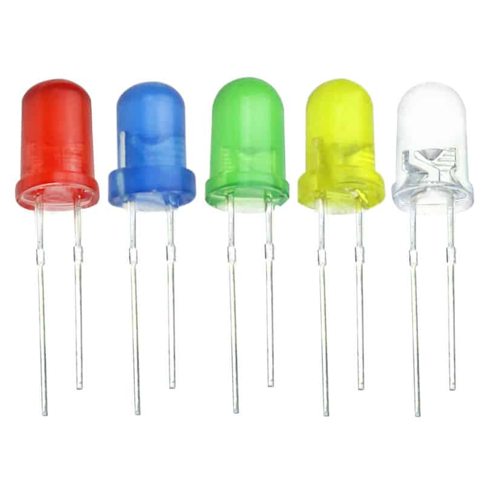

# Car-Parking-System
The source code for a car parking system which automates the boom barrier of the homeowners' parking garage and includes fire detection support. Code is written in VHDL and implemented on Altera DE10-Lite FPGA.

## System Description
The system uses two ultrasonic sensors to measure the distance between cars and the parking garage gate, one for the gate's front and one for the gate's rear. When a car is detected at the gate, the system gives the car driver 15 (adjustable) seconds to enter a password which is known only to the homeowners. If the password is correct, the boom barrier which is represented by a servo motor opens and a green led blinks. If the password is incorrect, the boom barrier does not open and a red led blinks. The system can also detect fires using a fire sensor and when fire is detected, a buzzing alert sound is played.

## Sensors
### 1)	 Ultrasonic sensor (HC-SR04)

Used to measure the distance between cars and the parking garage gate. One is placed on the gate's front and another is placed on the gate's rear.

### 2)	 Flame sensor

Used to detect fires inside the parking garage.

## Outputs
### 1)	Servo motor

Acts as a boom barrier.

### 2)	Buzzer

Alerts homeowners when fire is detected.

### 3)	LED light

A green LED blinks when the password entered is correct. A red LED blinks when the password entered is incorrect.

### 4)	Seven-segment display

Used to display password countdown and system messages.

System messages :-
* **EN** : means a driver can enter password. 
* **EE** : means password is incorrect. 
* **GO** : means boom barrier is open and the car can pass. 
* **SP** : means an incoming car should stop and wait till the car in front of it passes and the boom barrier closes again. 

## Note
This is a university (GUC) course project. Course name is (CSEN 605 : Digital System Design).
